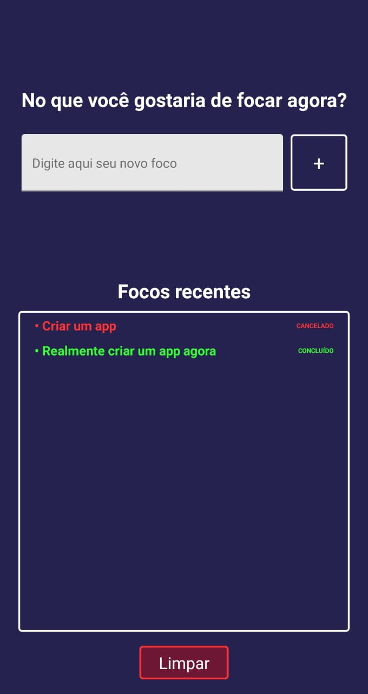

<h1 align="center"><strong>Focus Time App</strong></h1>

   
  
   

 
 

<strong>Para que serve este app?</strong>

O Focus Time foi criado através das videoaulas do curso <a href="https://www.udemy.com/course/complete-react-native-mobile-development-zero-to-mastery-with-hooks/">Complete React Native in 2021: Zero to Mastery [with Hooks]</a> da <a href="https://zerotomastery.io/">Zero To Mastery Academy</a> e o mesmo pode ser considerado como um app de gestão de tempo, no qual é possivel adicionar um <strong>Foco</strong>, apos adicionado o usuário pode escolher por quanto tempo estará focado naquele objetivo. Ao final do tempo corrido o celular vibra durante 5 segundos e o Foco é armazenado em Local Storage, sendo possivel ver o histórico defocos e se o mesmo foi concluido ou cancelado antes do termino do tempo corrido.

 

<strong>Tecnologias Utilizadas</strong>

   
   

 
 

<strong>Desafios de desenvolvimento</strong>

O principal desafio para mim foi criar uma versão do App que fosse única,  ou seja, adaptar grande parte do mesmo a certas funcionalidades que eu escolhi desenvolver, como por exemplo:

<li>Desenvolvimento de estilizações customizadas para botões</li>
<li>Adicionar o status final do foco na aba de "Focos recentes"</li>
<li>Criar mais opções de customização do tempo da tarefa (o app original possuia somente a opção de tempos fixos)</li>

 
 

<strong>Este projeto foi desenvolvido com ❤️ por <a href="https://github.com/g4brieloliveira">Gabriel Oliveira</a></strong>
